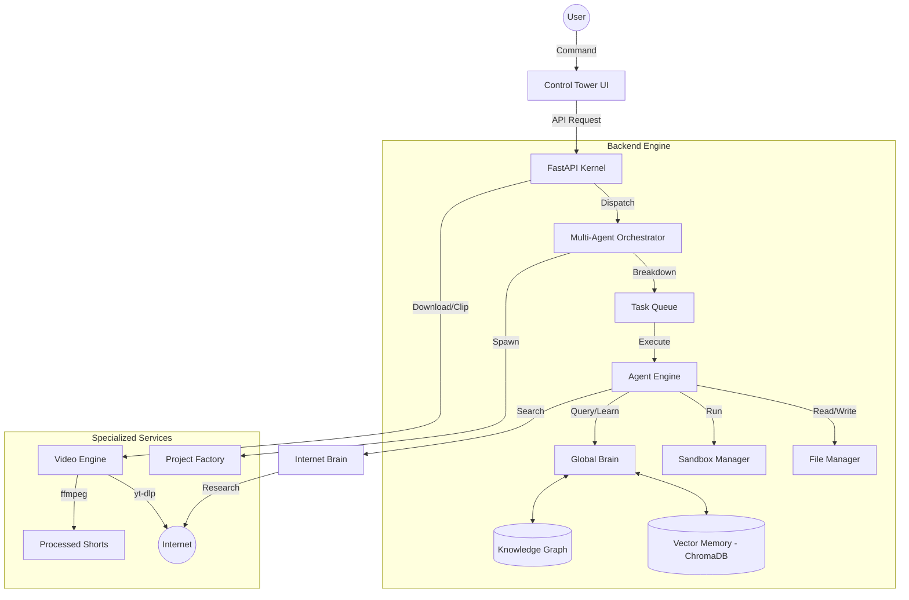

# AIOS: AI Automation OS - System Architecture

## 1. Project Overview
AIOS is a high-performance, multi-agent orchestration platform designed for autonomous software development and AI-driven automation. It features a FastAPI-based backend "Kernel" and a vanilla JavaScript "Control Tower" frontend. The system leverages Google Gemini 2.0 Flash for core reasoning, integrated with specialized agents, a vector-based long-term memory system, and an autonomous video processing pipeline.

## 2. Folder Structure Explanation
```text
C:\Users\Duy\.agent\youtube-tiktok-bot\
├── backend/                # FastAPI Kernel & Business Logic
│   ├── api/                # Dedicated API Endpoints (REST)
│   ├── core/               # Unified AI OS Engine
│   │   ├── auth/           # API Key Management & Rotation
│   │   ├── collaboration/  # Multi-agent Blackboard & Chat
│   │   ├── evolution/      # Self-evolution & Feedback Loops
│   │   ├── factory/        # Project & Product Spawning
│   │   ├── global_brain/   # Unified Memory & Knowledge Engine
│   │   ├── internet_brain/ # Web Search & Research Agents
│   │   ├── models/         # Local & Cloud LLM Integrations
│   │   ├── monitoring/     # Dashboard & Resource Tracking
│   │   ├── skills/         # Skill Discovery & Integration
│   │   ├── task_queue/     # Priority-based Task Management
│   │   └── tools/          # Web Search & External Utilities
│   ├── config.py           # Unified System Configuration
│   └── main.py             # Entry Point & Service Orchestration
├── frontend/               # Control Tower UI (HTML/JS/CSS)
├── spaceofduy/             # Workspace Root (Project Data & Memory)
│   ├── .memory/            # Persistence Layer (JSON & ChromaDB)
│   ├── videos/             # Source Media Library
│   └── shorts/             # Processed Vertical Content
└── logs/                   # System Event & Error Logs
```

## 3. System Startup Flow
When `backend/main.py` is executed:
1.  **Environment Loading**: `python-dotenv` loads keys from `.env` via `config.py`.
2.  **Service Initialization**:
    *   `MultiAgentOrchestrator`: Initializes the mission controller.
    *   `AgentOSScheduler`: Starts the background worker for tasks.
    *   `AutomationScheduler`: Starts the job scheduler (APScheduler).
    *   `ResourceManager`: Begins tracking CPU, RAM, and token usage.
3.  **FastAPI Startup**:
    *   `os_scheduler` and `automation_scheduler` workers are started as background tasks.
    *   Routers for projects, workflows, generation, and deployment are registered.
4.  **Uvicorn Server**: Starts the web server on port `8888`.

## 4. Agent Architecture
AIOS uses a "Manager-Worker" pattern:
*   **Mission Controller (Orchestrator)**: Acts as the general, breaking high-level goals into granular tasks.
*   **Specialized Agents**:
    *   **Architect**: High-level design and structure.
    *   **Developer**: Code implementation and optimization.
    *   **Tester**: QA, unit testing, and bug hunting.
    *   **Reviewer**: Security and performance audits.
*   **Agent Engine**: Powered by `google-generativeai` with built-in tools for file management, sandbox execution, and memory retrieval.

## 5. Workflow Execution
Workflows follow a structured pipeline:
1.  **Goal Analysis**: The Manager agent analyzes the user request.
2.  **Task Breakdown**: Granular tasks are added to the `TaskQueue`.
3.  **Execution Loop**: The `AgentOSScheduler` picks up pending tasks based on priority and dependencies.
4.  **Blackboard Collaboration**: Agents share intermediate results via a shared "Blackboard".
5.  **Checkpointing**: Workflow state is saved to `.workflow_state.json` for crash recovery.

## 6. Memory System (ChromaDB)
AIOS features a dual-layer memory system:
*   **Unstructured (Vector Memory)**: Uses ChromaDB to store text embeddings (code, chat history, insights) for semantic search.
*   **Structured (Knowledge Graph)**: Tracks relationships between files, classes, and project concepts.
*   **Global Brain**: Aggregates memory across all projects, allowing agents to learn from past missions.

## 7. Skill System
*   **Skill Discovery**: An autonomous process that searches GitHub/Web for new tools.
*   **Skill Runner**: Dynamically executes Python scripts or shell commands associated with a skill.
*   **Integration**: New skills can be "wrapped" and added to an agent's toolkit.

## 8. Project Factory
The `ProjectFactory` is responsible for:
*   **Project Spawning**: Automatically creating directory structures and initializing `README.md`.
*   **Environment Setup**: Registering projects in `projects_db.json`.
*   **Autonomous Initialization**: Spawning an initial "Architecture Mission" for every new project.

## 9. Video Processing Pipeline
1.  **Download**: `yt-dlp` fetches high-quality MP4 media into `spaceofduy/videos`.
2.  **Processing**: `ffmpeg` crops and scales horizontal video into 9:16 vertical format (720x1280).
3.  **Output**: Processed "Shorts" are stored in `spaceofduy/shorts` and made available for streaming/download.

## 10. Future Extensions
*   **Advanced Self-Evolution**: Agents optimizing their own prompts based on performance metrics.
*   **Multi-Modal Skills**: Native support for image generation and voice interaction.
*   **Cloud Deployment Integration**: Direct deployment to AWS/Vercel via the `DeployEngine`.

---

## System Flow Diagram


